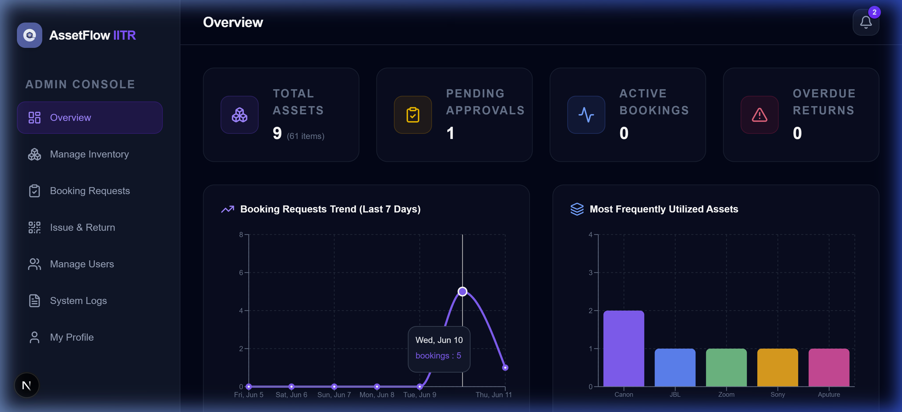
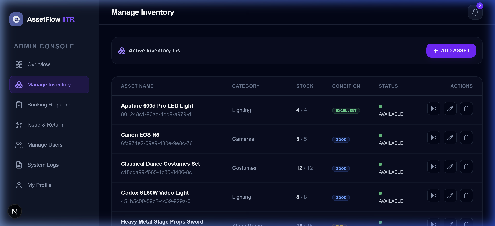
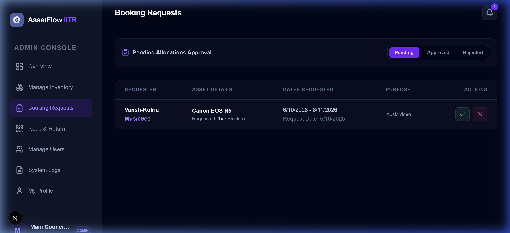
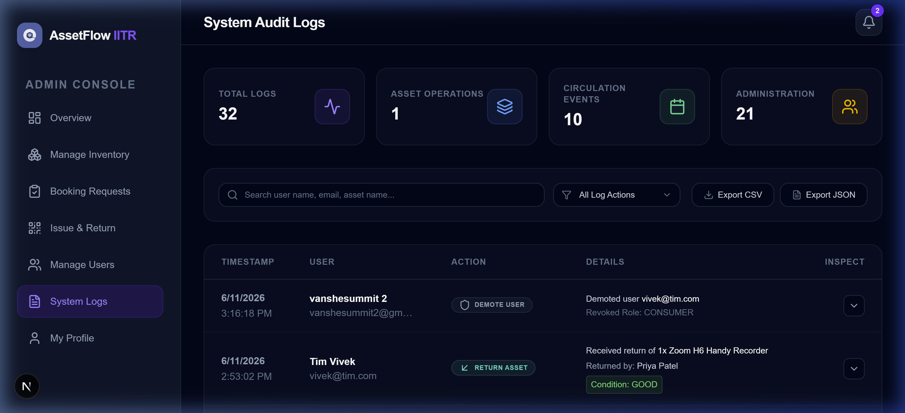

# Smart Asset Management and Resource Allocation Platform

## Project Overview
The Smart Asset Management and Resource Allocation Platform (AssetFlow) is a full-stack web application designed for the Cultural Council of IIT Roorkee. It provides a centralized dashboard for tracking, managing, reserving, and maintaining assets such as cameras, microphone systems, stage lights, props, costumes, and event infrastructure. The platform enables administrators to manage inventories, approve or reject booking requests, monitor item checkouts and check-ins using QR codes, and trace system-wide operations, while consumer users can browse assets, check availability, and request bookings.

---

## Screenshots

### Dashboard


### Asset Catalog


### Booking Management


### Audit Logs


---

## Technology Stack
- **Framework**: Next.js 15 (App Router) with TypeScript
- **Styling**: Tailwind CSS v4 with PostCSS
- **Database**: PostgreSQL with Prisma ORM
- **Authentication**: NextAuth.js supporting Credentials (email and password) and OAuth providers (Google and GitHub)
- **Utilities**: Recharts (for analytics dashboards), html5-qrcode (for scanner integration), qrcode (for label rendering), and Cloudinary (for avatar storage)

---

## System Architecture
The application runs on a unified Next.js App Router layer where Server Actions communicate directly with the database using Prisma. Route authorization is managed by NextAuth middleware.

```
User
  ↓
Next.js App
  ↓
NextAuth
  ↓
Prisma ORM
  ↓
PostgreSQL
```
```
## Features

### Authentication & Onboarding
- Registration and login using credentials (email and password).
- Onboarding redirect that forces first-time Google or GitHub users to complete their profile setup before accessing the dashboard.
- Access restrictions preventing standard consumer members from accessing admin screens.

### Asset Discovery & Reservation
- Dynamic filter catalogs for browsing and filtering assets by category.
- Real-time conflicts check using a peak sweep-line scheduling algorithm.
- Calendar constraints preventing past-date reservations and ensuring the return date follows the checkout date.

### Checkout & Return Circulation
- Integrated web-camera QR code scanner to process checkouts and returns.
- Automatic maintenance log creation when assets are returned with a status of "DAMAGED".

### Admin Management Console
- Member role adjustment options allowing admins to promote standard consumers to admin status or demote secondary admins.
- Security checks preventing admins from demoting themselves to avoid lockouts.

### Activity Audit Logging
- Audit log console tracking admin operations (creating assets, approving bookings, issuing items, modifying user roles).
- Detailed changes layout comparing previous and updated asset attributes.
- Download capabilities for exporting logs in CSV and JSON formats.
- Client-side pagination and full-text keyword searches.

---

## Installation & Setup

### Prerequisites
- Node.js 22+
- PostgreSQL 16+
- Docker (optional)

### Environment Variables
Create a `.env` file in the root directory and copy the format from `.env.example`:
```env
DATABASE_URL=

NEXTAUTH_SECRET=
NEXTAUTH_URL=

AUTH_GOOGLE_ID=
AUTH_GOOGLE_SECRET=

AUTH_GITHUB_ID=
AUTH_GITHUB_SECRET=

CLOUDINARY_CLOUD_NAME=
CLOUDINARY_API_KEY=
CLOUDINARY_API_SECRET=
```

### Database Setup
Run the following commands to generate the database client and push the schema structure to your PostgreSQL database:
```bash
npx prisma generate
npx prisma db push
```

### Seed Data
Initialize the database with mock administrators, members, assets, bookings, and audit records:
```bash
npx prisma db seed
```

---

## Running the Application

### Development
To launch the local development server:
```bash
npm run dev
```
Open your browser and navigate to http://localhost:3000.

### Production
To create an optimized production build:
```bash
npm run build
npm run start
```

---

## Default Test Accounts

### Admin Account
- **Email**: admin@cultural.iitr.ac.in
- **Password**: AdminPassword123

### Member Account
- **Email**: rohan@cultural.iitr.ac.in
- **Password**: MemberPassword123

---

## Folder Structure

```
src/
├── app/
│   ├── actions/      (Server Actions)
│   ├── admin/        (Admin dashboards)
│   ├── api/          (Auth API endpoints)
│   ├── dashboard/    (Consumer dashboards)
│   └── login/        (Sign-in page)
├── components/       (Shared Header, Sidebar, forms)
├── lib/              (Database pools, auth settings)
├── hooks/            (Custom hooks)
└── types/            (Auth type definitions)

prisma/
├── schema.prisma     (DB structure)
└── seed.js           (Mock data initializer)

docs/                 (Architecture and screenshots)
```

---

## API Routes
The platform uses secure server actions instead of public API routes:
- `auth`: Handles register submissions.
- `profile`: Manages name, section updates, and Cloudinary avatar uploads.
- `assets`: Handles asset creation, edits, deletion, and inventory check-out overlap logic.
- `bookings`: Processes member requests, admin approvals, and status cancellations.
- `operations`: Connects physical check-outs and check-ins (including QR codes verification).
- `users`: Manages permissions and lists members.
- `audit`: Exposes administrative logging records securely.

---

## Database Schema
The system models include:
- `User`: Stores credentials, oauth credentials, section clubs, and role permissions.
- `Account` & `Session`: Core tables mapping next-auth user logins.
- `Asset`: Retains description details, categorizations, counts, and base64 QR strings.
- `Booking`: Manages reservations, quantities, statuses, and return confirmations.
- `ReturnLog`: Logs return checks, condition states, and the checking admin's comments.
- `MaintenanceLog`: Records repair processes, reporter logs, and damage notes.
- `AuditLog`: Immutable table tracking admin action params in JSON blocks.
- `Notification`: Stores user-directed status alert notifications.

---

## Future Enhancements
- Automated email notices prompting users of pending returns.
- PDF generation utilities for bulk printing asset labels.
- Offline support caching checkouts when network connectivity is lost.

---

## License
MIT License
